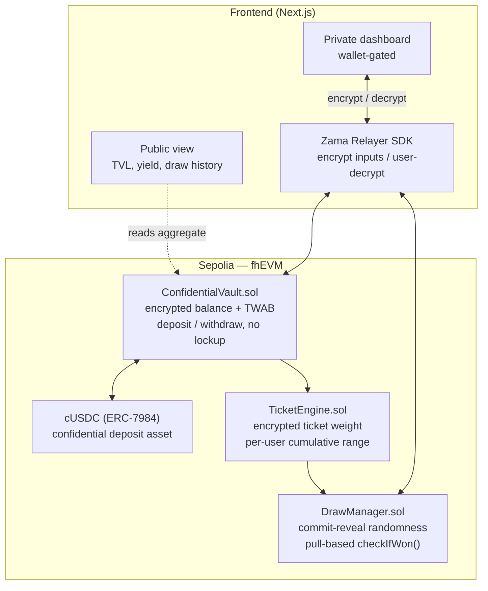
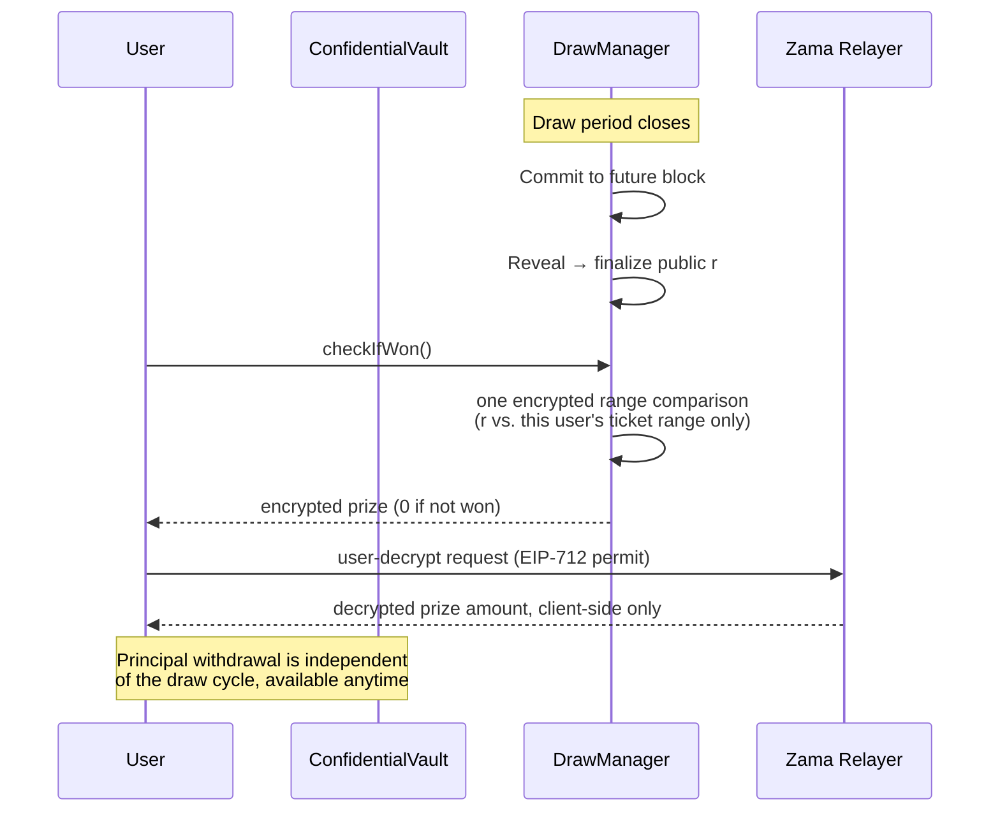

# Zealed

Confidential prize savings, built on the Zama Protocol. Submission for Zama Developer Program Mainnet Season 4 — Bounty Track.

## Live demo (Sepolia)

- **App:** [https://considers-bottles-kodak-bargain.trycloudflare.com](https://considers-bottles-kodak-bargain.trycloudflare.com) (Cloudflare quick tunnel over the production Next.js build — ephemeral; for a durable URL run `npx vercel --prod` from `apps/web` after `vercel login`)
- **Network:** Ethereum Sepolia (`11155111`)
- **Deposit asset:** [cUSDCMock](https://sepolia.etherscan.io/address/0x7c5BF43B851c1dff1a4feE8dB225b87f2C223639) (`0x7c5BF43B851c1dff1a4feE8dB225b87f2C223639`) — Zama Wrappers Registry confidential USDC mock
- **Underlying mock USDC:** [ERC20 mock](https://sepolia.etherscan.io/address/0x9b5Cd13b8eFbB58Dc25A05CF411D8056058aDFfF) (`0x9b5Cd13b8eFbB58Dc25A05CF411D8056058aDFfF`) — public `mint`, then wrap into cUSDCMock

### Getting test cUSDC (faucet)

Judges and new wallets need cUSDC before they can deposit. Do this on Sepolia (the in-app faucet at `/dashboard/faucet` runs the same steps):

1. **Mint** mock USDC on the underlying token `0x9b5Cd13b8eFbB58Dc25A05CF411D8056058aDFfF` via public `mint(to, amount)`.
2. **Approve** that token for the cUSDCMock wrapper `0x7c5BF43B851c1dff1a4feE8dB225b87f2C223639` via ERC-20 `approve(wrapper, amount)`.
3. **Wrap** into confidential cUSDC by calling `wrap(to, amount)` on the wrapper (amount is underlying units; the wrapper’s `rate()` scales mint size the same way as `packages/contracts/scripts/smoke-sepolia.ts`).

After wrap, use the dashboard: **Approve the vault** (`setOperator` on cUSDCMock) → **Deposit**.

### Verified contracts

| Contract | Address | Explorer |
|---|---|---|
| ConfidentialVault | `0x8793b30f385Af66E09320F1AEB652025C0BaE584` | [Etherscan](https://sepolia.etherscan.io/address/0x8793b30f385Af66E09320F1AEB652025C0BaE584#code) |
| TicketEngine | `0xDf7E69448F1803444a1d7986d19B2575fFB635a5` | [Etherscan](https://sepolia.etherscan.io/address/0xDf7E69448F1803444a1d7986d19B2575fFB635a5#code) |
| DrawManager | `0xBE0607B1866fF62554CF267CA9357A9f733fFC88` | [Etherscan](https://sepolia.etherscan.io/address/0xBE0607B1866fF62554CF267CA9357A9f733fFC88#code) |

Deploy script (full trio: vault + TicketEngine + DrawManager, then wires `setTicketEngine` + `setDrawManager`): `packages/contracts/scripts/deploy-sepolia.ts`. Addresses also in `packages/contracts/deployments/sepolia.json`.

**Redeploy note (Aug 26, 2026):** `deploy-sepolia.ts` always deploys a fresh trio. TicketEngine index/freeze history and vault balances from the prior deployment do not carry over. DrawManager-only swaps are not possible today because `TicketEngine.setDrawManager` can only be called by the current DrawManager.

### Draw keeper flow (permissionless)

Both `commitDraw` and `revealDraw` are **permissionless** (no admin key). Production PoolTogether adopters run a **keeper** so savers never send those txs.

**Demo keeper** (Hardhat signer / deployer key, polls every 15s):

```bash
pnpm keeper
```

(`packages/contracts` → `hardhat run scripts/keeper-sepolia.ts --network sepolia`). It commits when `MIN_DRAW_INTERVAL` has elapsed (public prize **1 cUSDC**) and reveals after the reveal block. It does not call `checkIfWon`. The Claim **Complete draw** button stays as a fallback if the keeper is down.

The landing pool and the vault chart show the public countdown. Manual one-shot smoke:

`packages/contracts/scripts/smoke-draw-sepolia.ts` (or `RUN_DRAW=1` on `smoke-sepolia.ts`).

1. **`commitDraw(revealBlock, prizeAmount)`** — freezes TicketEngine weights (snapshot for the draw), bumps `drawId`, and picks a future `revealBlock`. Requires `revealBlock >= block.number + MIN_REVEAL_DELAY` (**5 blocks**, ~1 minute on Sepolia) and at least **`MIN_DRAW_INTERVAL` (20 minutes)** since the previous commit. Both values are demo-scaled; production would use a longer cadence (e.g. daily) and a wider commit-to-reveal gap.
2. Wait until the reveal block is mined (and within the 256-block `blockhash` window).
3. **`revealDraw(totalTickets, decryptionProof)`** — public-decrypts total tickets, sets plaintext `r`, marks the draw settled. Weights stay frozen so `checkIfWon` cannot be gamed by post-reveal deposits that inflate a live Fenwick range against an already-finalized `r`.
4. Users call **`checkIfWon`**, then user-decrypt their pending prize.
5. **`unfreezeWeights()`** (also permissionless) reopens ticket syncs, or the next `commitDraw` unfreezes-then-refreezes.

Information leakage by design: `r`, prize size, and total tickets are public after reveal. Individual balances, weights, and win amounts stay encrypted unless the user decrypts or opts into `revealWin` (tier only).

### Sepolia smoke results

Against the prior Sepolia deployment (Relayer SDK self-relay, not Hardhat mock FHE):

- `setOperator` → encrypt → `deposit` → user-decrypt balance → `withdraw` → public TVL decrypt: **passed**
- commit → wait blocks → `publicDecrypt(totalTickets)` → `revealDraw` → `checkIfWon` → user-decrypt prize: **passed** (prize `1000`)

Re-run smoke against the addresses above after redeploy before treating those results as current.

Observed vs mock/local (flag for judges / future you):

- **Gas:** deposit ~1.6–1.7M, withdraw ~1.7M, `checkIfWon` ~444k on this draw (Fenwick depth for one depositor). Mock tests do not reflect these costs.
- **Relayer latency:** `createInstance` ~10–36s, `encrypt` ~18–22s, `userDecrypt` ~4–5s, `publicDecrypt` ~3–4s. Public RPCs can `ConnectTimeout` during encrypt — use a stable Sepolia RPC (Infura) for scripts / wallet RPC.
- **Hardhat FHE plugin:** not initialized on `--network sepolia`; do **not** rely on `hre.fhevm` for live smokes. Use `@zama-fhe/relayer-sdk` and pass explicit `gasLimit` on FHE txs so Hardhat does not `eth_estimateGas` through the uninitialized plugin.
- **Decryption pattern (SKILL §0):** live path is self-relay (`makePubliclyDecryptable` + `publicDecrypt` / `checkSignatures` for aggregates & `revealWin`; EIP-712 `userDecrypt` for balances/prizes). No gateway callback.
- **cUSDC:** on Sepolia use the registry **cUSDCMock** (mint underlying → `approve` → `wrap`), not a local `MockERC7984`.

## Description

Zealed is a confidential version of a no-loss prize savings protocol (the PoolTogether model): users deposit into a shared pool, the yield the pool generates is distributed through periodic prize draws, and principal stays withdrawable at any time. Deposits, balances, and individual winnings are encrypted end-to-end using fully homomorphic encryption (FHE) via the Zama Protocol. Winner selection is provably fair and publicly verifiable, without exposing any individual's position.

## Value Proposition

Today's on-chain prize savings apps are public by default: exact deposit sizes, exact odds, and every draw's winners are visible to anyone watching the chain. That transparency has a cost — it discourages exactly the users (privacy-conscious individuals, companies, DAOs, families) who'd otherwise use the product, because participating means broadcasting your savings behavior on a public ledger.

Zealed keeps the fairness guarantee — the draw is still verifiable, the math still checks out — while making individual positions private by default. Nobody, including other depositors, block explorer users, or the protocol's own observers, can see an individual's deposit size, balance, or draw outcome unless that person chooses to reveal it. Confidentiality here isn't a compliance checkbox, it's the feature that makes the product usable by the segment the public version structurally excludes.

## Architecture



### Draw flow — the pull-based design

Winner selection does not loop over depositors on-chain. A public random value is finalized via commit-reveal, then each user checks their own eligibility on demand — this keeps draw settlement O(1) regardless of pool size, and is the core architectural decision behind this build (see `build-brief.md` Section 5 and `SKILL.md` Section 3 for the full rationale).



## Passed Tests

This section is a snapshot, not a guarantee — update it as new modules land. Current as of Week 1 (`ConfidentialVault` complete):

| Suite | Test | Status |
|---|---|---|
| ConfidentialVault | reverts when constructed with the zero asset address | ✅ |
| ConfidentialVault | deposits encrypted amount and updates balance + TWAB without emitting plaintext amounts | ✅ |
| ConfidentialVault | withdraws principal at any time with no lockup | ✅ |
| ConfidentialVault | transfers zero and keeps balance when withdraw exceeds encrypted balance | ✅ |
| ConfidentialVault | accrues TWAB over time as a time-weighted average of balance | ✅ |
| ConfidentialVault | isolates balances across depositors | ✅ |
| ConfidentialVault | tracks publicly decryptable TVL; oversized withdraw leaves total unchanged | ✅ |
| TicketEngine | Fenwick indices, weight sync, freeze semantics | ✅ |
| DrawManager | checkIfWon O(log n), lose=encrypted zero, commit-reveal | ✅ |
| DrawManager | revealWin tier-only selective disclosure | ✅ |
| Frontend flows | public + private dashboard (TVL + revealWin toggle) | ✅ |

Run locally:

```bash
pnpm --filter @zealed/contracts test
```

## Tech Stack

- **Contracts:** Solidity, fhEVM (`@fhevm/solidity` 0.11.1), Hardhat, deployed to Sepolia
- **Confidential asset:** cUSDC (ERC-7984) via OpenZeppelin confidential contracts; `MockERC7984` for local testing
- **Frontend:** Next.js 15, TypeScript, wagmi/viem, Zama Relayer SDK (encrypt / user-decrypt via EIP-712 permit)
- **Randomness:** commit-reveal against a future block hash — the drawn value is public, only individual positions stay encrypted
- **Monorepo:** pnpm + Turborepo
- **Agent tooling:** project-specific skill and rule files for Claude Code (`.claude/skills/zealed-fhevm/`) and Cursor (`.cursor/rules/`), kept in sync with this repo's actual shipped code — see `SKILL.md` Section 8 for build history

## Roadmap

**In scope for the Season 4 bounty submission (by Sep 5, 2026):**
- Confidential deposit/withdraw vault — shipped
- TicketEngine + pull-based draw settlement — shipped
- Prize claim with client-side decryption — UI shipped (decrypt pending prize)
- Public aggregate view + private wallet-gated dashboard — shipped (`apps/web`)
- Optional post-win selective disclosure (`revealWin()`) — shipped (tier only, off by default)

**Path to production, if selected for further development:**
- Professional smart contract audit (Zama has indicated OpenZeppelin audit support for the strongest submission)
- Shadow Circles — private group/family/DAO pooled vaults with internal privacy between members
- Anti-whale progressive ticket weighting, toggleable
- Compliance/auditor selective-reveal mode for regulated depositors
- Multi-asset pool support beyond cUSDC

Items in the second list are explicitly out of scope for the bounty deadline — see `build-brief.md` Section 10. They're listed here as direction, not commitments for September.