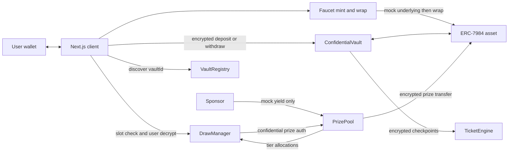

# Zealed

Confidential prize savings on [Zama](https://www.zama.org/) fhEVM: a privacy-preserving take on the [PoolTogether](https://pooltogether.com/) no-loss prize model.


---

## Overview

Zealed is a **curated multi-vault** confidential prize-savings protocol. Savers pick an ERC-7984 asset vault, keep deposits encrypted, withdraw principal at any time, and privately check eligibility for periodic prizes. Prizes are paid only from a separate sponsor-funded pool, never from saver principal.

Live on **Ethereum Sepolia** via a verified `VaultRegistry` that lists independent vault systems (cUSDC, cUSDT, cWETH, cZAMA, cXAUt, cBRON). Deployment records: [`docs/deployment.md`](docs/deployment.md).

---

## What is this for?

Public prize-savings apps broadcast deposit sizes, odds, and winners on-chain. That deters privacy-conscious individuals, companies, DAOs, and families who would otherwise save in a no-loss lottery.

Zealed keeps the fairness properties of prize savings (verifiable draw lifecycle, bounded tiers, auditable prize liquidity) while making **individual positions private by default**. Other depositors, explorers, and protocol observers cannot see a user’s deposit, balance, or draw outcome unless that user decrypts client-side.

---

## PoolTogether × Zama

| Idea | PoolTogether (reference) | Zealed |
| --- | --- | --- |
| Principal | Always withdrawable | Always withdrawable (encrypted ERC-7984) |
| Prize funding | Yield / contributed prize assets, not deposits | Sponsor-funded mock yield in `PrizePool` only |
| Odds | Proportional to deposit | Encrypted cumulative balance / Fenwick range |
| Draw | Public winners | Encrypted slots + pull-based private checks |
| Privacy | Public by default | FHE on fhEVM; EIP-712 user decryption |

Zealed adopts PoolTogether’s separation of **principal vs prize liquidity** and multi-tier prize budgeting, then implements eligibility and outcomes with Zama FHE (`FHE.randEuint64()`, ACL-gated ciphertext, client user-decrypt).

---

## Architecture

Canonical design: [`docs/architecture.md`](docs/architecture.md). Product requirements: [`build-brief.md`](build-brief.md).



### Multi-vault

One registry entry is an isolated bundle:

```text
vaultId → asset + ConfidentialVault + TicketEngine + PrizePool + DrawManager
```

- `VaultRegistry` is curated and **non-custodial** (no funds).
- Assets and components cannot be reused across entries.
- Deactivation hides discovery only; principal withdrawal stays on the vault contract.

### Multi-tier prizes

Each draw uses a fixed bounded config (Grand / Standard / Community): tier shares, reserve, and a small number of slots per tier (`PrizePool.TIER_COUNT = 3`, `MAX_SLOTS_PER_TIER = 4`). Unused tier liquidity rolls over after the claim window.

### Draw model (pull-based)

1. Close accrues an immutable Fenwick / cumulative-balance snapshot; new deposits continue on a new version.
2. Award allocates tier budgets and stores **encrypted** `FHE.randEuint64()` per slot.
3. Each user checks **one** `(draw, tier, slot)`: encrypted range compare to encrypted prize or encrypted zero (no plaintext lose signal).
4. User decrypts locally via EIP-712-authorized relayer flow.
5. After the claim window, keeper reconciles rollover.

Winner checks **never loop over depositors**.

### Faucet

Sepolia demo wallets mint the selected vault’s official mock underlying, approve, and wrap to ERC-7984 (`/dashboard/faucet`). That is for **principal deposits**, not prize funding.

### Accounting vocabulary

- **Principal TVL**: saver deposits in `ConfidentialVault` (always withdrawable).
- **Available prize liquidity**: uncommitted sponsor funds in `PrizePool`.
- **Reserve / tier allocation / rollover**: prize-side buckets only.

Never combine these into an ambiguous “pool size.”

---

## Tech stack

| Layer | Stack |
| --- | --- |
| Contracts | Solidity, `@fhevm/solidity`, Hardhat, OpenZeppelin confidential contracts (ERC-7984) |
| Randomness | Onchain `FHE.randEuint64()` per prize slot |
| Frontend | Next.js 15, TypeScript, wagmi / viem, Privy, TanStack Query, Tailwind, Framer Motion |
| FHE client | `@zama-fhe/relayer-sdk` (encrypt + EIP-712 user decrypt) |
| Monorepo | pnpm + Turborepo |
| Network | Ethereum Sepolia (fhEVM) |

---

## Tests

Verified locally: **33** contract tests and **24** web unit tests passing.

### Contracts (`pnpm --filter @zealed/contracts test`)

**ConfidentialVault**
- rejects zero-address dependencies and protects TicketEngine configuration
- deposits encrypted principal and exposes only wallet-authorized balances
- withdraws encrypted principal immediately and keeps TVL exact
- turns an oversized encrypted withdrawal into a zero-value no-op
- updates cumulative-balance observations without mixing depositor state
- emits no plaintext amount fields for vault actions

**TicketEngine**
- uses immutable owner-only wiring and permanent one-based indexes
- tracks current encrypted balances without cross-account leakage
- computes exact balance-time weights and cumulative boundaries
- keeps a closed snapshot immutable across later withdrawal checkpoints

**PrizePool**
- validates immutable configuration and owner-only one-time wiring
- synchronizes public accounting to the actual confidential token balance
- allocates all three tiers, multiple slots, reserve, and rounding dust
- remains reserve-solvent after every allocated slot is claimed
- requires nonzero contributions and operator authorization

**DrawManager**
- closes, verifies the public total, allocates, and awards bounded FHE-random slots
- selects exactly one winner per slot across all tiers and returns encrypted zero on loss
- covers the full single-user range and excludes a zero-weight historical range
- decrypts pending prizes, pays winners from PrizePool, and guards check and claim replay
- keeps principal withdrawable during closed, awarded, and active-claim phases
- expires checks and claims, then reconciles actual balance into solvent reserve and rollover
- recovers an empty period with a verified cancellation
- keeps first-check gas bounded as depositor count grows

**VaultRegistry**
- registers and enumerates two independently wired asset vaults
- keeps balances and principal custody isolated between vaults
- rejects unauthorized, duplicate, incomplete, and mismatched systems
- rejects every cross-wired component relationship
- can hide a vault from discovery without blocking principal withdrawal

**privacy surface**
- does not expose amount fields in protocol events

**keeperAction**
- waits before the interval and closes when an initial or reconciled period matures
- awards a closed non-awarded draw
- waits during the claim window
- prepares then finalizes reconciliation after expiry

### Web (`pnpm --filter @zealed/web test`)

**format**
- round-trips six-decimal token amounts
- rejects malformed and over-precise input
- keeps deposit defaults inside euint64 for 18-decimal units
- formats compact public aggregates and draw clocks

**walletError**
- maps wallet rejection to quiet copy
- does not expose verbose library metadata
- maps insufficient gas without exposing raw RPC text

**wrapperMeta**
- decodes curated vault ids into lowercase slugs
- builds workspace paths and prize vault names
- maps official Sepolia mock addresses without mixing symbols
- defaults faucet mint to about $100 of each wrapper

**useWrappedAsset**
- isolates wrapped balances by underlying, wrapper, and account

**useDrawCycle**
- moves an open period through close and award
- moves expired draws through reconciliation
- stays loading without verified configuration

**usePublicDrawData**
- maps public lifecycle fields without user data

**PrivateOddsPanel**
- compounds the per-slot chance across a bounded tier
- clamps impossible weights and rejects empty domains

**PublicPoolOverview**
- keeps principal, available prizes, reserve, and tiers separately labelled

**VaultsDirectory**
- lists isolated vaults without a combined pool size column
- keeps connected positions sealed in the directory

**VaultSelector**
- presents active curated vaults and changes the selected bundle

**NetworkGuard**
- blocks transaction controls on the wrong network
- renders children when disconnected

Playwright e2e lives under `apps/web/e2e/` (`pnpm --filter @zealed/web test:e2e`).

```bash
pnpm --filter @zealed/contracts test
pnpm --filter @zealed/web test
pnpm --filter @zealed/web test:e2e
```

---

## How to run locally

**Requirements:** Node.js ≥ 20, pnpm 9.

```bash
pnpm install
```

### Contracts

```bash
# Optional: hardhat vars set MNEMONIC / INFURA_API_KEY / ETHERSCAN_API_KEY
cp packages/contracts/.env.example packages/contracts/.env   # set SEPOLIA_RPC_URL if needed

pnpm --filter @zealed/contracts compile
pnpm --filter @zealed/contracts test
```

Sepolia ops (funded deployer): see [`docs/deployment.md`](docs/deployment.md) for `vault:add:sepolia`, `prizes:fund:sepolia`, and `pnpm keeper`.

### Web app

```bash
cp apps/web/.env.example apps/web/.env.local
# Set NEXT_PUBLIC_PRIVY_APP_ID, NEXT_PUBLIC_PRIVY_CLIENT_ID,
# NEXT_PUBLIC_VAULT_REGISTRY_ADDRESS (default in .env.example)

pnpm --filter @zealed/web dev
# → http://localhost:3001
```

App routes:

- `/`: marketing landing
- `/dashboard`: vault directory (Principal TVL vs available prize liquidity)
- `/dashboard/{slug}`: vault workspace
- `/dashboard/faucet`: mint + wrap mock underlying

---

## Repository layout

```text
apps/web/                  Next.js client
packages/contracts/        Hardhat + fhEVM contracts
docs/architecture.md       System design
docs/economics.md          Prize liquidity accounting
docs/privacy.md            Confidentiality boundary
docs/operations.md         Draw / keeper lifecycle
docs/deployment.md         Sepolia deployment
build-brief.md             Canonical product requirements
LICENSE                    BSD 3-Clause Clear
```

---

## License

This project is licensed under the **BSD 3-Clause Clear License**. See [`LICENSE`](LICENSE).

`packages/contracts` also declares `BSD-3-Clause-Clear` (fhEVM / Zama ecosystem alignment).

---

## References

- [Zama Solidity guides](https://docs.zama.org/protocol/solidity-guides)
- [Zama encrypted randomness](https://docs.zama.org/protocol/solidity-guides/smart-contract/operations/random)
- [Zama user decryption](https://docs.zama.org/protocol/examples/basic/decryption/fhe-user-decrypt-single-value)
- [PoolTogether V5 protocol design](https://dev.pooltogether.com/protocol/design/)
- [PoolTogether Prize Pool](https://dev.pooltogether.com/protocol/reference/prize-pool/)
