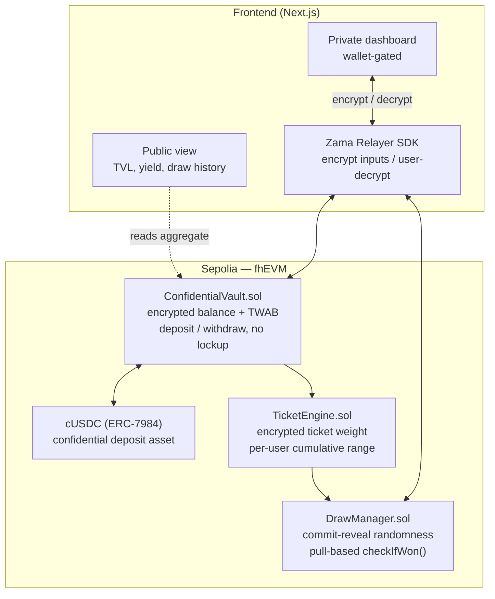
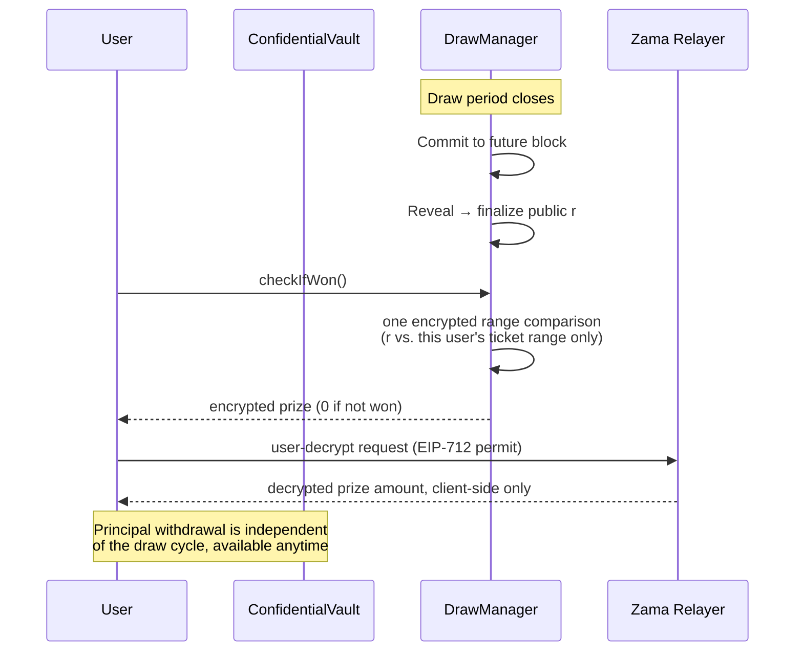

# Zealed

Confidential prize savings, built on the Zama Protocol. Submission for Zama Developer Program Mainnet Season 4 — Bounty Track.

> Status: in progress. Deadline Sep 5, 2026. See `build-brief.md` for the full spec and `.claude/skills/zealed-fhevm/SKILL.md` for build history.

## Description

Zealed is a confidential version of a no-loss prize savings protocol (the PoolTogether model): users deposit into a shared pool, the yield the pool generates is distributed through periodic prize draws, and principal stays withdrawable at any time. Deposits, balances, and individual winnings are encrypted end-to-end using fully homomorphic encryption (FHE) via the Zama Protocol. Winner selection is provably fair and publicly verifiable, without exposing any individual's position.

## Value Proposition

Today's on-chain prize savings apps are public by default: exact deposit sizes, exact odds, and every draw's winners are visible to anyone watching the chain. That transparency has a cost — it discourages exactly the users (privacy-conscious individuals, companies, DAOs, families) who'd otherwise use the product, because participating means broadcasting your savings behavior on a public ledger.

Zealed keeps the fairness guarantee — the draw is still verifiable, the math still checks out — while making individual positions private by default. Nobody, including other depositors, block explorer users, or the protocol's own observers, can see an individual's deposit size, balance, or draw outcome unless that person chooses to reveal it. Confidentiality here isn't a compliance checkbox, it's the feature that makes the product usable by the segment the public version structurally excludes.

## Architecture



### Draw flow — the pull-based design

Winner selection does not loop over depositors on-chain. A public random value is finalized via commit-reveal, then each user checks their own eligibility on demand — this keeps draw settlement O(1) regardless of pool size, and is the core architectural decision behind this build (see `build-brief.md` Section 5 and `SKILL.md` Section 3 for the full rationale).



## Passed Tests

This section is a snapshot, not a guarantee — update it as new modules land. Current as of Week 1 (`ConfidentialVault` complete):

| Suite | Test | Status |
|---|---|---|
| ConfidentialVault | reverts when constructed with the zero asset address | ✅ |
| ConfidentialVault | deposits encrypted amount and updates balance + TWAB without emitting plaintext amounts | ✅ |
| ConfidentialVault | withdraws principal at any time with no lockup | ✅ |
| ConfidentialVault | transfers zero and keeps balance when withdraw exceeds encrypted balance | ✅ |
| ConfidentialVault | accrues TWAB over time as a time-weighted average of balance | ✅ |
| ConfidentialVault | isolates balances across depositors | ✅ |
| TicketEngine | Fenwick indices, weight sync, freeze semantics | ✅ |
| DrawManager | checkIfWon O(log n), lose=encrypted zero, commit-reveal | ✅ |
| Frontend flows | public + private dashboard scaffold | ✅ (Week 3) |

Run locally:

```bash
pnpm --filter @zealed/contracts test
```

## Tech Stack

- **Contracts:** Solidity, fhEVM (`@fhevm/solidity` 0.11.1), Hardhat, deployed to Sepolia
- **Confidential asset:** cUSDC (ERC-7984) via OpenZeppelin confidential contracts; `MockERC7984` for local testing
- **Frontend:** Next.js 15, TypeScript, wagmi/viem, Zama Relayer SDK (encrypt / user-decrypt via EIP-712 permit)
- **Randomness:** commit-reveal against a future block hash — the drawn value is public, only individual positions stay encrypted
- **Monorepo:** pnpm + Turborepo
- **Agent tooling:** project-specific skill and rule files for Claude Code (`.claude/skills/zealed-fhevm/`) and Cursor (`.cursor/rules/`), kept in sync with this repo's actual shipped code — see `SKILL.md` Section 8 for build history

## Roadmap

**In scope for the Season 4 bounty submission (by Sep 5, 2026):**
- Confidential deposit/withdraw vault — shipped
- TicketEngine + pull-based draw settlement — shipped
- Prize claim with client-side decryption — UI shipped (decrypt pending prize)
- Public aggregate view + private wallet-gated dashboard — shipped (`apps/web`)
- Optional post-win selective disclosure (`revealWin()`) — blocked on contracts (not implemented yet)

**Path to production, if selected for further development:**
- Professional smart contract audit (Zama has indicated OpenZeppelin audit support for the strongest submission)
- Shadow Circles — private group/family/DAO pooled vaults with internal privacy between members
- Anti-whale progressive ticket weighting, toggleable
- Compliance/auditor selective-reveal mode for regulated depositors
- Multi-asset pool support beyond cUSDC

Items in the second list are explicitly out of scope for the bounty deadline — see `build-brief.md` Section 10. They're listed here as direction, not commitments for September.