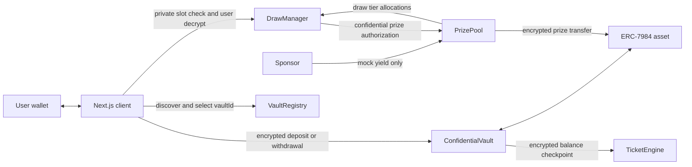

# Zealed Target Architecture

Status: target design for the curated multi-vault, multi-tier protocol. For product requirements,
terminology, and scope, `build-brief.md` is canonical. Deployment records determine which registered
vault systems are live.

## Design goals

- Keep ERC-7984 principal confidential and withdrawable at all times.
- Support multiple curated ERC-7984 assets without mixing their custody or accounting.
- Freeze eligibility by snapshot, not by freezing saver funds.
- Isolate sponsor-funded mock yield from principal.
- Support a bounded spectrum of prize tiers and slots.
- Keep randomness, eligibility checks, outcomes, and prize transfers encrypted.
- Scale by pull-based per-user checks without enumerating depositors.

## Components and fund flow



For each registered `vaultId`, its `ConfidentialVault` is the only principal custodian and its
`PrizePool` is the only prize-liquidity custodian. `VaultRegistry` holds no funds. An accounting
invariant must show that draw creation and prize payment cannot reduce principal TVL or consume
assets belonging to another vault.

## Curated multi-vault topology

One registry entry is an immutable component bundle:

```text
vaultId -> asset + ConfidentialVault + TicketEngine + PrizePool + DrawManager
```

Registration validates both directions of every one-time relationship. An asset and each component
address can belong to only one entry. This prevents a frontend, keeper, or deployment mistake from
combining one vault's principal with another vault's ticket history or prize liquidity.

Registry deactivation affects discovery only. It cannot pause or route withdrawals because users call
the asset-specific `ConfidentialVault` directly. New assets are admitted by the registry owner after
their complete bundle is deployed, tested, and wired. Permissionless listing and multiple strategies
for the same asset are separate future designs.

## Accounting model

### Principal TVL

Principal TVL is the aggregate saver liability held by one selected `ConfidentialVault`. Individual
balances and amounts remain encrypted. If the aggregate is made publicly decryptable, it is still only
an aggregate, must be labeled “Principal TVL,” and must never be summed across unlike assets.

Principal TVL cannot be:

- allocated to a tier;
- moved into reserve;
- used to cover a prize;
- treated as mock yield.

### Prize liquidity

`PrizePool` receives explicit sponsor transfers that simulate yield while the target design is under development. Its accounting identity is:

```text
funded prize assets
= available prize liquidity
+ reserve
+ active tier allocations
+ claim obligations
+ paid prize assets
```

Implementation details may add settled or pending buckets, but every unit must be represented once.

- **Available prize liquidity** is uncommitted and distributable.
- **Reserve** is held back as a prize-liquidity backstop.
- **Tier allocations** are draw-specific budgets.
- **Rollover** is a transition that returns unused tier liquidity to future availability.

PoolTogether’s prize-pool design is the reference for separating deposited principal from contributed prize liquidity and distributing the latter across tiers and reserve. Zealed uses a smaller fixed, bounded configuration suitable for fhEVM costs.

## Versioned eligibility snapshots

`TicketEngine` combines cumulative-balance checkpoints with versioned Fenwick trees.

### Active version

Deposits and withdrawals update:

1. the user’s encrypted balance checkpoint;
2. the user’s encrypted cumulative-balance state;
3. the user’s encrypted weight in the active Fenwick version.

Fenwick updates touch O(log n) nodes. User indexes are stable and tree walks have a configured maximum depth.

### Sealed version

When a draw closes:

1. the active version and close timestamp are associated with the draw;
2. cumulative-balance observations needed for that interval become the immutable eligibility basis;
3. a new active version accepts later balance changes.

Sealing eligibility must not lock ERC-7984 principal. A withdrawal after close changes the new active version and transfers principal immediately; it does not rewrite the closed draw.

The implementation must use structural sharing, checkpoint lookup, copied roots, or another bounded versioning technique. Copying all users or all tree nodes at draw close is prohibited.

## Multi-tier prize model

Each draw records a public tier configuration:

- tier identifier;
- bounded slot count;
- aggregate tier allocation;
- per-slot prize policy;
- claim deadline and rollover destination.

The number of tiers and total slots are bounded constants or bounded configuration values. No draw transition may grow work according to depositor count.

Tier configuration and aggregate allocations are public. Whether a particular user matches a slot, and the resulting prize credited to that user, remain encrypted.

## Encrypted random slots

For every configured prize slot, `DrawManager` generates `FHE.randEuint64()` in a transaction and stores the resulting ciphertext with the draw and slot identifier.

Zama documents this operation as a cryptographically secure encrypted random value whose PRNG state is updated on-chain. The ciphertext is not publicly decrypted. The implementation must:

- grant only the ACL permissions needed for later contract computation;
- bind each value permanently to one draw and slot;
- prevent regeneration or caller-selected replacement;
- map the 64-bit value to the sealed snapshot domain with a documented bias analysis;
- test zero-weight and domain-boundary behavior.

## Pull-based checks

A user requests a check for one `(drawId, tierId, slotId)` tuple.

The selected `vaultId` resolves the draw manager before this call. Draw identifiers are local to that
vault system and are not globally interchangeable.

1. Resolve the draw’s sealed snapshot.
2. Obtain the caller’s encrypted prefix sum and encrypted weight.
3. Derive the encrypted half-open range `[start, start + weight)`.
4. Compare the slot’s encrypted random value with that range.
5. Use `FHE.select` to produce the configured encrypted prize or encrypted zero.
6. Store replay protection and ACL-gated result state for the caller.

No transaction scans depositors. Losing is not a revert condition because transaction success would become a public outcome signal.

The cost target is O(log n) for the caller’s Fenwick proof plus a constant amount of work for one prize slot.

## Confidentiality boundary

Encrypted:

- user deposits, withdrawals, and balances;
- user cumulative balances and weights;
- user prefix ranges;
- slot random values;
- user win/loss results and prizes.

Public:

- principal TVL only if explicitly aggregate-decrypted;
- aggregate sponsor funding and prize-pool buckets;
- tier definitions, allocations, and slot counts;
- draw lifecycle and snapshot version;
- action occurrence without a user amount.

No plaintext user amount is emitted or logged. Public aggregates must be intentionally authorized for public decryption; being stored as a ciphertext handle does not make a value public.

## Client decryption

The frontend uses Zama’s user-decrypt flow:

1. read the ciphertext handle;
2. generate the user-decrypt key material client-side;
3. sign the EIP-712 authorization for the relevant contract;
4. request user decryption through the relayer;
5. decrypt locally.

Both the user and the contract need the required persistent ACL permission. There is no backend decryption service and no privileged decrypt function.

## Security invariants

- `ConfidentialVault` principal assets are at least the encrypted depositor liability represented by vault accounting.
- `PrizePool` cannot transfer from the vault or debit principal TVL.
- Registry entries contain complete, matching bundles and cannot reuse an asset or component.
- No balance, snapshot, draw, random slot, or prize liability crosses a vault boundary.
- Total prize-bucket accounting does not exceed sponsor-funded assets held by `PrizePool`.
- A sealed snapshot is immutable.
- A user index is not reassigned across snapshot history.
- Each random ciphertext is generated once and bound to one draw slot.
- Each account checks a draw slot at most once.
- A losing path stores encrypted zero and does not reveal the result in control flow, events, or logs.
- Work is bounded by Fenwick depth and configured slot counts, never depositor enumeration.

## Implementation status

The repository is being refactored toward this architecture. Documentation can describe the target, but source code, tests, deployment records, and frontend availability determine what is currently implemented. Do not publish addresses for this architecture until the matching contracts are implemented, deployed, and verified.

## References

- [Zama: generate random encrypted numbers](https://docs.zama.org/protocol/solidity-guides/smart-contract/operations/random)
- [Zama: ACL examples](https://docs.zama.org/protocol/solidity-guides/smart-contract/acl/acl_examples)
- [Zama: user decrypt single value](https://docs.zama.org/protocol/examples/basic/decryption/fhe-user-decrypt-single-value)
- [Zama: encrypted types](https://docs.zama.org/protocol/solidity-guides/smart-contract/types)
- [PoolTogether V5 protocol design](https://dev.pooltogether.com/protocol/design/)
- [PoolTogether Prize Pool reference](https://dev.pooltogether.com/protocol/reference/prize-pool/)
- [PoolTogether Prize Vault reference](https://dev.pooltogether.com/protocol/reference/prize-vault/)
